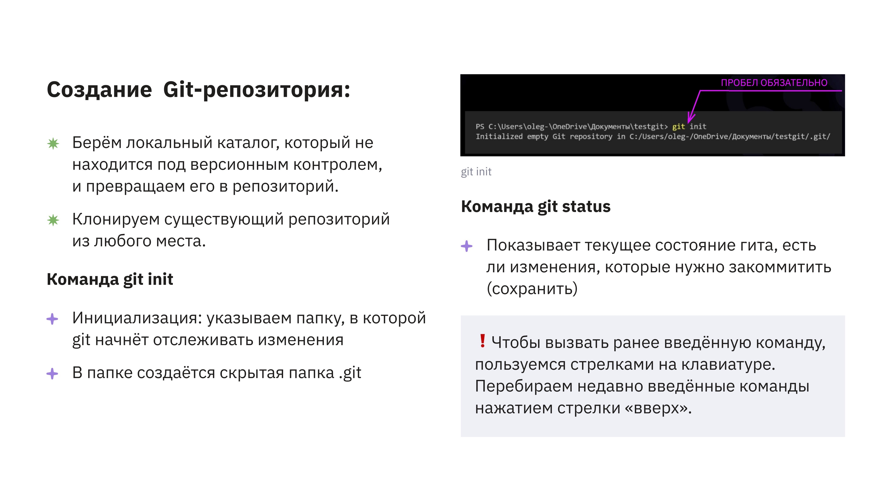
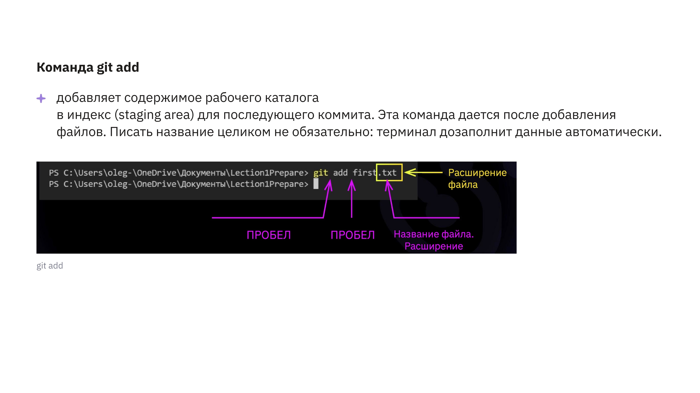
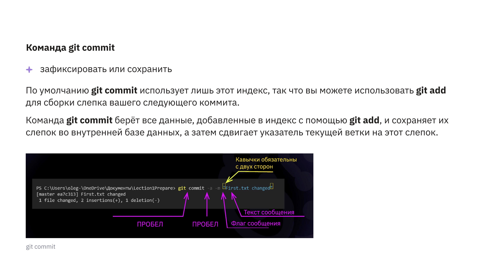
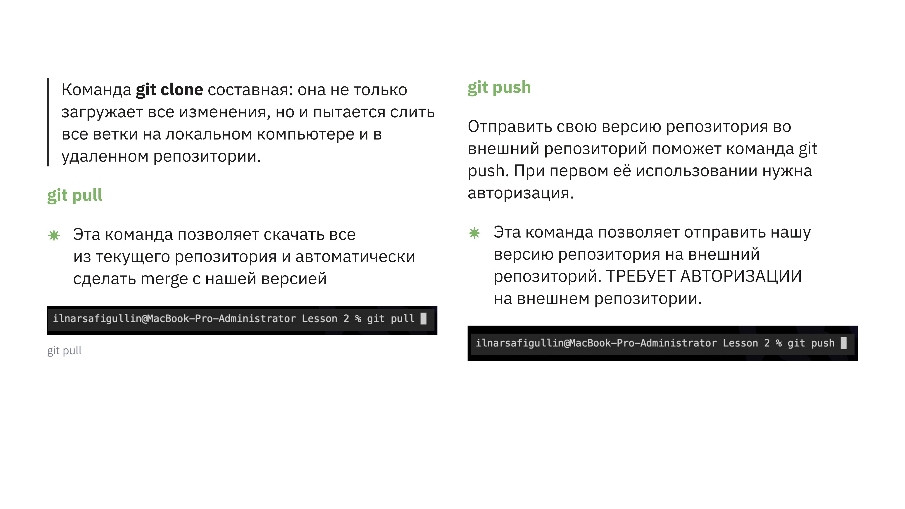
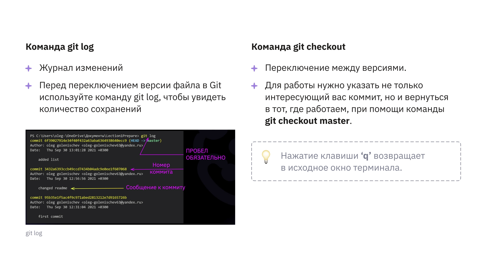
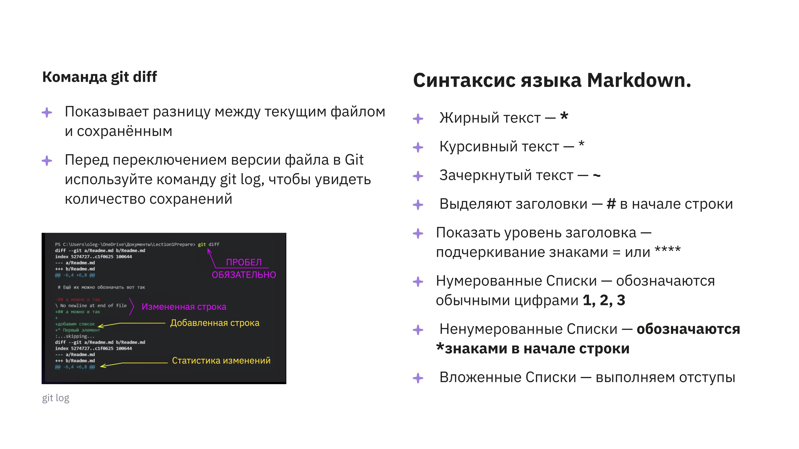
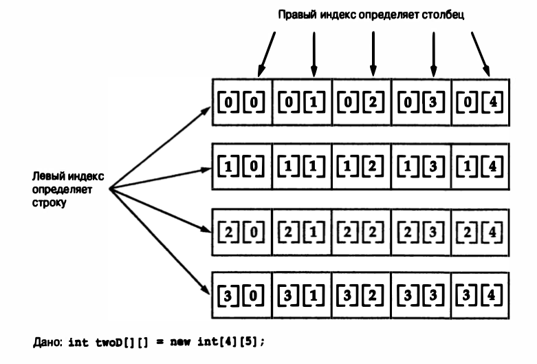
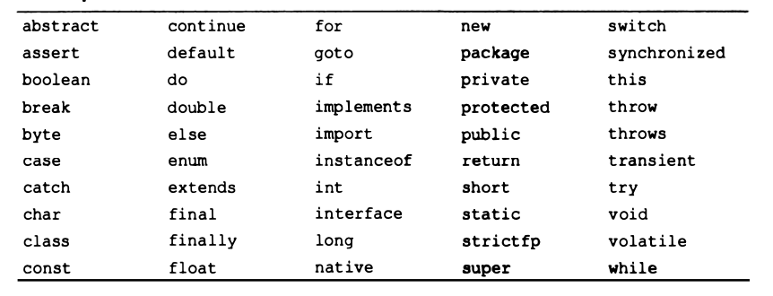

## Урок 1. Синтаксис языка:
1. Основы синтаксиса: CamelCase, однострочный и многострочные комметарии 
2. Горячие клавиши
3. Примитивные типа данных
4. Управляющие операторы
5. Массивы
6. Вввод вывол. Класс Scanner - основные методы

## Урок 2.  Система контроля версия GitHub:
[Описание команд git](src/main/resources/lesson2/git_command.txt)
1. git init
2. git status

3. git add

4. git commit

5. git remote
6. git push

7. дополнительные возможности:

## Урок 3. Синтаксис Java (продолжение):
1. Двумерные массивы

2. Ключевые слова Java

3. Укороченные логические операции. Оператор присваивания
4. Тернарный оператор
5. Методы в java

#### Урок 4.
1. Основы классов
2. Объявление объектов
3. Методы классов
4. Кострукторы классов

